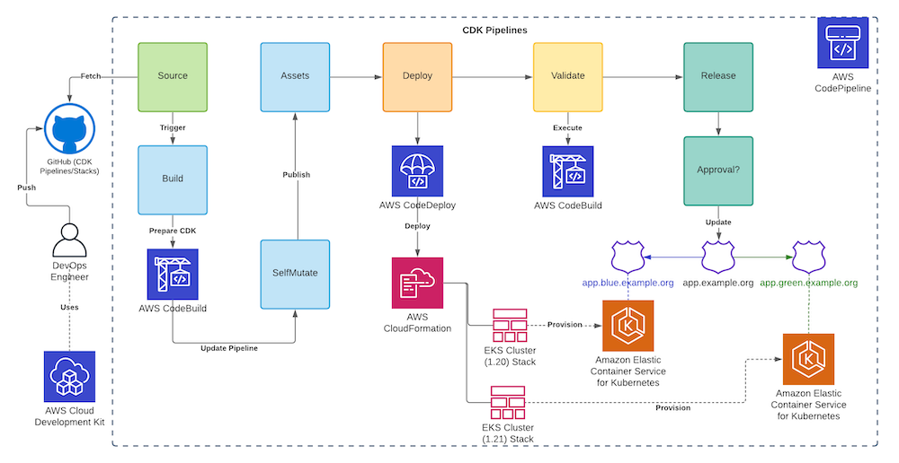
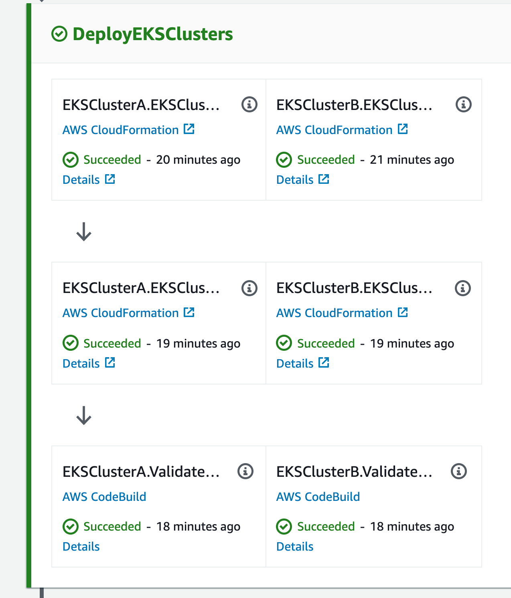
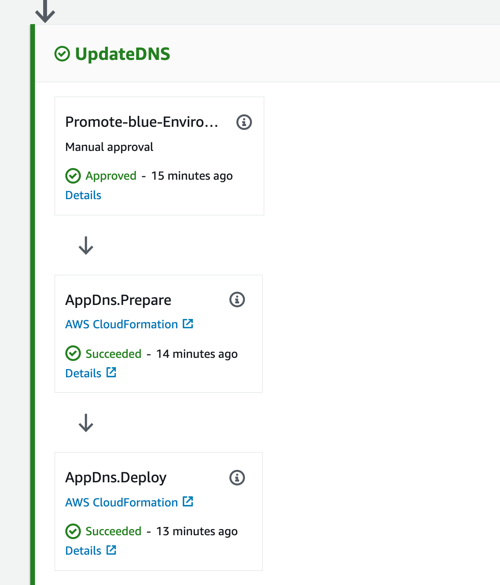

## CDK Pipelines for EKS Cluster(s)

## Overview

This project uses CDK Pipelines to define a self mutating pipeline to deploy EKS Cluster(s) to perform tasks like: Blue/Green cluster upgrade, replicate clusters consistently across environments/accounts and etc. It uses CDK for cluster, node, infrastructure and app configuration.

### Pipeline

This is the pipeline generated by CDK Pipelines with the following stages: Source, Build, UpdatePipeline, Assets, DeployEKSClusters, UpdateDNS

### Node

- Node Policy
- Custom Launch Template

### Infrastructure 

Uses Helm Charts and IRSA

- CA (cluster-autoscaler)
- metrics-server
- prometheus
- AWS Load Balancer Controller
- external-dns
- Calico (tigera-operator)
- Containers Insigths (amazon-cloudwatch and aws-for-fluent-bit)

### App

- Deployment
- Service
- Ingress

### DNS

- Route53

## Deployment

To deploy the pipeline for the first time, you'll need a GitHub secret name `github-oauth-token` in your Secrets Manager and then you can deploy it using `cdk deploy`. After the first deploy, any change that you push to your Git Repository will update the Pipeline and execute.

This project also uses two SSM parameters: `/eks-cdk-pipelines/hostZoneId` (String) and `/eks-cdk-pipelines/zoneName` (String). You can use `parameters.sh` to interactively include your parameters.

## Security

See [CONTRIBUTING](CONTRIBUTING.md#security-issue-notifications) for more information.

## License

This library is licensed under the MIT-0 License. See the LICENSE file.

